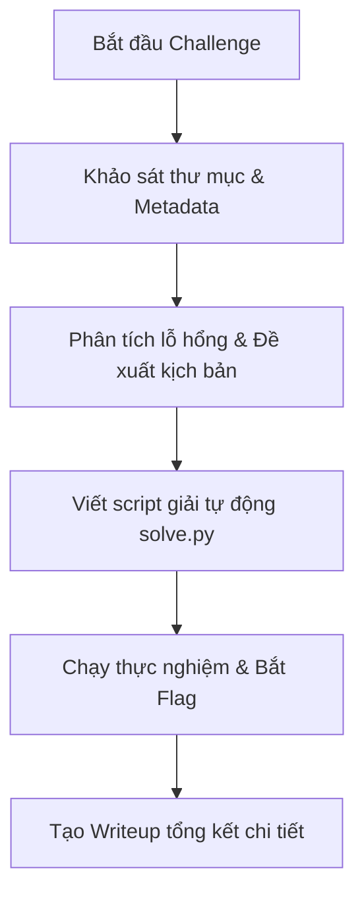

# 📘 Hướng Dẫn Sử Dụng Toàn Diện: WebGPT Gateway & Claude Code Tool (`gpt`)

Tài liệu này hướng dẫn chi tiết cách sử dụng bộ công cụ **`gpt`** (WebGPT Inference Gateway kết hợp Claude Code CLI) để giải quyết các bài toán lập trình, phân tích mã nguồn và giải các thử thách CTF (Web, Crypto, Reverse, Pwn, Misc, AI Security).

---

## 📑 Mục Lục
1. [Tổng Quan Kiến Trúc & Công Cụ](#1-tổng-quan-kiến-trúc--công-cụ)
2. [Cách Dùng Nhanh (Quick Start)](#2-cách-dùng-nhanh-quick-start)
3. [Quy Trình Chuẩn Khi Xử Lý 1 Challenge](#3-quy-trình-chuẩn-khi-xử-lý-1-challenge)
4. [Bộ Prompt Mẫu Demo (Prompt Playbook)](#4-bộ-prompt-mẫu-demo-prompt-playbook)
5. [Kỹ Thuật Đóng Gói File & Dữ Liệu Lớn](#5-kỹ-thuật-đóng-gói-file--dữ-liệu-lớn)
6. [Xử Lý Lỗi Thường Gặp (Troubleshooting)](#6-xử-lý-lỗi-thường-gặp-troubleshooting)

---

## 1. 🚀 Tổng Quan Kiến Trúc & Công Cụ

Bộ công cụ bao gồm:
- **WebGPT Gateway Service (`http://127.0.0.1:18000`)**: Daemon chạy ngầm 100% headless, kết nối phiên làm việc với mô hình GPT-5.6 / GPT-4o live mà không mở bất kỳ cửa sổ trình duyệt nào lên màn hình.
- **Lệnh CLI `gpt` (`/home/light/.local/bin/gpt`)**: Wrapper thông minh, tự động kiểm tra gateway service và chuyển tiếp phiên làm việc vào Claude Code CLI với đầy đủ cấu hình Anthropic API.

---

## 2. ⚡ Cách Dùng Nhanh (Quick Start)

### Chế độ 1: Tương tác trực tiếp (Interactive Pair-Programming)
Mở bất kỳ terminal nào và gõ:
```bash
# Di chuyển vào thư mục dự án / bài thi
cd /path/to/your/challenge

# Bắt đầu làm việc với Claude Code
gpt
```

### Chế độ 2: Thực thi một lệnh duy nhất (Non-interactive / One-shot)
```bash
gpt -p "Khảo sát thư mục hiện tại, phân tích README.md và đề xuất giải pháp."
```

### Chế độ 3: In kết quả dạng Markdown sạch ra terminal
```bash
gpt -p "Viết mã Python tính dãy Fibonacci" --print
```

### Chế độ 4: Tự động hóa giải lặp & tự sửa lỗi đến khi ra Flag (`gpt-solve`)
Nếu bài thi cần chạy thực nghiệm nhiều vòng, tự sửa lỗi code khi chưa ra flag:
```bash
gpt-solve /path/to/challenge "https://<INSTANCE_URL>" --max-retries 5
```

### Chế độ 5: Master Agent điều phối song song toàn bộ giải đấu (`gpt-master`)
Chạy tự động quét toàn bộ thư mục CTF, giải song song nhiều bài, tự động khởi động lại session khi tắc nghẽn và báo cáo các bài cần bạn hỗ trợ:
```bash
gpt-master /home/light/Workspace/CTF/CTF_Da_Nang_2026/ --workers 4 --max-retries 5
```

### Chế độ 6: Đua Swarm Agent giải cùng 1 bài (`gpt-race`)
Huy động toàn bộ 4-8 workers cùng thi đấu giải **1 bài duy nhất** với các góc tấn công khác nhau (Side-channel, Fuzzing, Auth Bypass, Rapid PoC). Worker nào bắt được Flag trước sẽ chiến thắng và lập tức dừng các worker còn lại:
```bash
gpt-race /path/to/challenge "https://<INSTANCE_URL>" --workers 4
```

---

## 3. 🎯 Quy Trình Chuẩn Khi Xử Lý 1 Challenge



### Bước 1: Khảo sát & Đọc dữ liệu đề bài
Vào thư mục bài thi và yêu cầu AI đọc toàn bộ file `metadata.json`, `README.md`, file đính kèm:
```bash
gpt -p "Đọc kỹ file metadata.json và README.md trong thư mục này. Phân tích loại bài, mục tiêu và công nghệ được sử dụng."
```

### Bước 2: Xây dựng kịch bản khai thác
Yêu cầu AI phân tích điểm yếu và lên kế hoạch:
```bash
gpt -p "Dựa trên mô tả bài toán, hãy phân tích bề mặt tấn công (Attack Surface) và liệt kê các bước cần thực hiện để lấy flag."
```

### Bước 3: Sinh script giải (`solve.py`)
Yêu cầu AI viết mã giải bằng Python tự động:
```bash
gpt -p "Viết file solve.py bằng Python để tương tác với target URL, thực hiện khai thác tự động và in ra flag."
```

### Bước 4: Chạy thử nghiệm & Trích xuất cờ
```bash
python3 solve.py "https://<INSTANCE_URL>"
```

### Bước 5: Tổng hợp Writeup
```bash
gpt -p "Viết báo cáo kỹ thuật hoàn chỉnh lưu vào writeup/WRITEUP.md bao gồm: Tổng quan, Phân tích lỗ hổng, Các bước khai thác, Mã nguồn solve.py và Flag."
```

---

## 4. 📝 Bộ Prompt Mẫu Demo (Prompt Playbook)

### 📌 Mẫu 1: Phân tích bài thi tổng quát (General Triage)
```text
Bạn là chuyên gia an toàn thông tin đang tham gia giải CTF.
Hãy khảo sát toàn bộ thư mục hiện tại:
1. Đọc metadata.json và README.md để hiểu yêu cầu đề bài.
2. Kiểm tra các file đính kèm (source code, binary, pcap, văn bản).
3. Đưa ra nhận định ban đầu về thể loại lỗ hổng và hướng tiếp cận.
```

### 📌 Mẫu 2: Phân tích Web / API / Prompt Injection
```text
Thử thách này liên quan đến ứng dụng web tích hợp AI/RAG.
1. Khảo sát các API endpoints có sẵn (/api/upload, /api/chat, /api/query, ...).
2. Phân tích cơ chế hoạt động của bot duyệt tự động (Admin Bot).
3. Thiết kế payload Indirect Prompt Injection nhằm vượt qua bộ lọc an toàn và trích xuất biến môi trường / secret token.
4. Cập nhật mã khai thác hoàn chỉnh vào solve.py.
```

### 📌 Mẫu 3: Phân tích Reverse Engineering / Source Code Audit
```text
Hãy phân tích file mã nguồn [tên_file]:
1. Đọc luồng thực thi chính từ hàm main/entry point.
2. Tìm kiếm các hàm xử lý dữ liệu đầu vào nhạy cảm (buffer, deserialization, auth, command execution).
3. Chỉ ra vị trí chính xác của lỗ hổng (dòng code, nguyên nhân).
4. Viết script exploit / giải mã bằng Python vào solve.py.
```

### 📌 Mẫu 4: Tạo Writeup chuẩn thi đấu
```text
Hãy tạo một bài writeup CTF chuyên nghiệp lưu vào writeup/WRITEUP.md:
- Tiêu đề, Category, Điểm số, Flag.
- Challenge Description & Reconnaissance.
- Vulnerability Analysis: Cơ chế kỹ thuật chi tiết.
- Step-by-step Exploitation: Từng bước thực nghiệm kèm lệnh curl/request mẫu.
- Automated Exploit Code (solve.py).
- Defensive Mitigations & Key Takeaways.
```

---

## 5. 📦 Kỹ Thuật Đóng Gói File & Dữ Liệu Lớn

Khi gặp thư mục bài thi có nhiều file hoặc file dung lượng lớn, bạn có thể dùng script Python tự động đóng gói toàn bộ file dạng text hoặc Base64 rồi gửi vào prompt:

```python
#!/usr/bin/env python3
import base64, subprocess, os
from pathlib import Path

TARGET_DIR = Path(".")
files_block = []

for p in TARGET_DIR.iterdir():
    if p.is_file() and not p.name.startswith("."):
        try:
            content = p.read_text(encoding="utf-8")
            files_block.append(f"=== FILE: {p.name} ===\n{content}\n=== END FILE ===")
        except Exception:
            b64 = base64.b64encode(p.read_bytes()).decode("ascii")
            files_block.append(f"=== BINARY FILE (BASE64): {p.name} ===\n{b64}\n=== END FILE ===")

prompt = "Dưới đây là các file trong bài thi:\n\n" + "\n\n".join(files_block) + "\n\nHãy phân tích và giải quyết challenge."
subprocess.run(["gpt", "-p", prompt, "--print"])
```

---

## 6. 🛠️ Xử Lý Lỗi Thường Gặp (Troubleshooting)

| Lỗi / Hiện tượng | Nguyên nhân | Cách khắc phục |
| :--- | :--- | :--- |
| `API Error: 400 Prompt exceeds WEBGPT_MAX_PROMPT_CHARS` | Dung lượng prompt + file đính kèm quá lớn | Tăng biến môi trường: `export WEBGPT_MAX_PROMPT_CHARS=200000` (đã được cấu hình mặc định 200k trong gateway). |
| `SSL: CERTIFICATE_VERIFY_FAILED` khi chạy `solve.py` | Domain CTF sử dụng chứng chỉ tự ký (`*.nip.io`) | Thêm `verify=False` trong `requests.get/post` và gọi `urllib3.disable_warnings()`. |
| Claude Code hỏi Trust Dialog (`Do you trust this folder?`) | Thư mục mới chưa được phê duyệt trong config | Script tự động thêm `"hasTrustDialogAccepted": true` vào file `~/.claude.json`. |
| Gateway báo `ECONNREFUSED 127.0.0.1:18000` | Gateway service chưa khởi động | Chạy `systemctl --user restart webgpt-gateway.service` hoặc đơn giản gõ lệnh `gpt` (lệnh `gpt` sẽ tự động khởi động gateway nếu chưa chạy). |

---

## 💡 Mẹo Sử Dụng Nâng Cao
- **Giữ ngữ cảnh nhiều lượt (Multi-turn session)**: Sử dụng lệnh `gpt` không tham số để mở phiên hội thoại liên tục, mô hình sẽ ghi nhớ toàn bộ tiến trình điều tra của bạn từ đầu đến cuối phiên.
- **Tận dụng Slash Commands trong Claude Code**: Bạn có thể dùng `/clear` để reset ngữ cảnh khi bắt đầu challenge mới, hoặc gõ `/help` để xem các tính năng mở rộng.
