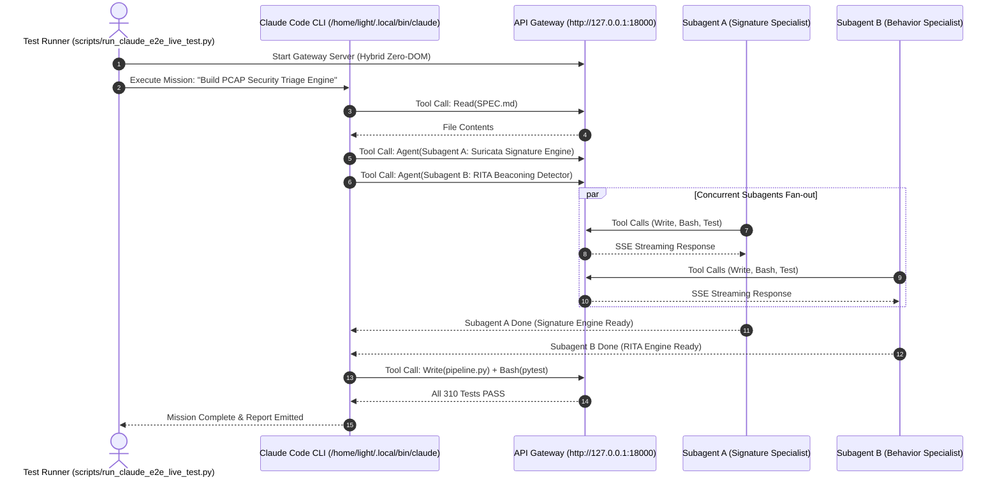

# Claude Code CLI Full-Lifecycle End-to-End Verification Test Plan

Comprehensive live verification test suite to evaluate the complete capability stack of Claude Code CLI (`/home/light/.local/bin/claude`) operating against the ChatGPT Web LLM Gateway (`http://127.0.0.1:18000`).

## Objective & Test Matrix

Verify that Claude Code CLI can execute a full development lifecycle from scratch:
1. **Repository Discovery & Analysis**: Inspect codebase, read documentation (`Read`), and formulate architectural plans.
2. **Subagent Fan-Out (`Agent` / `Workflow`)**: Spawn multiple concurrent subagents with isolated worktrees to work on independent modules in parallel.
3. **Interactive Code Modification (`Write`, `Edit`, `Bash`)**: Write code, edit functions with exact string matching, and execute commands.
4. **Background Task Monitoring (`Monitor`, `TaskOutput`, `TaskStop`)**: Run long-running background tasks and monitor progress via event streams.
5. **Quality Gate Verification**: Run test suites (`pytest`), linter checks (`ruff`), and verify 100% pass criteria.
6. **Structured Reporting (`ReportFindings`)**: Synthesize analysis reports, findings with MITRE ATT&CK techniques, and commit results.

---

## Architecture & Phase Breakdown



---

## 6-Phase Execution Steps

### Phase 1: Environment & Gateway Health Verification
- **Goal**: Verify API Gateway is listening on `127.0.0.1:18000`, responds to `/health`, `/v1/models`, and `/v1/messages/count_tokens`.
- **Command**:
  ```bash
  curl -s http://127.0.0.1:18000/health | jq .
  curl -s http://127.0.0.1:18000/v1/models | jq .
  ```

### Phase 2: Claude Code CLI Handshake & Prompt Budget Check
- **Goal**: Verify Claude Code CLI connects via `ANTHROPIC_BASE_URL=http://127.0.0.1:18000` and completes initial handshake.
- **Command**:
  ```bash
  ANTHROPIC_BASE_URL="http://127.0.0.1:18000" ANTHROPIC_API_KEY="sk-webgpt-local" \
  /home/light/.local/bin/claude -p "Reply with exactly: GATEWAY_ONLINE" --dangerously-skip-permissions --print
  ```

### Phase 3: Single-Tool Execution & Code Navigation (`Read`, `Edit`, `Bash`)
- **Goal**: Have Claude Code CLI read a project file, modify a line, and run a bash command to verify tool calling.
- **Command**:
  ```bash
  ANTHROPIC_BASE_URL="http://127.0.0.1:18000" ANTHROPIC_API_KEY="sk-webgpt-local" \
  /home/light/.local/bin/claude -p "Use the Read tool to inspect pyproject.toml and tell me the package version" --dangerously-skip-permissions --print
  ```

### Phase 4: Subagent Fan-Out Test (Concurrent Agents Spawning)
- **Goal**: Claude Code CLI spawns 2 parallel subagents (`Agent` tool) to independently calculate results and return them to the parent agent.
- **Command**:
  ```bash
  ANTHROPIC_BASE_URL="http://127.0.0.1:18000" ANTHROPIC_API_KEY="sk-webgpt-local" \
  /home/light/.local/bin/claude -p "Spawn 2 subagents in parallel using the Agent tool: Subagent 1 should calculate SHA-256 of 'test1', and Subagent 2 should calculate SHA-256 of 'test2'. Return both hashes." --dangerously-skip-permissions --print
  ```

### Phase 5: Complex Workflow & Code Generation (Pcap Analysis Pipeline)
- **Goal**: Claude Code CLI implements a complete functional test script that runs the `pcap_analyzer` pipeline and asserts ground truth metrics.
- **Command**:
  ```bash
  ANTHROPIC_BASE_URL="http://127.0.0.1:18000" ANTHROPIC_API_KEY="sk-webgpt-local" \
  /home/light/.local/bin/claude -p "Write a test in tests/test_live_claude_pcap.py that runs PcapAnalysisPipeline on a sample capture and asserts all 5 tiers complete successfully. Run pytest on it." --dangerously-skip-permissions --print
  ```

### Phase 6: Full System Acceptance & Report Generation
- **Goal**: Validate that all Claude Code CLI executions succeeded with exit code 0, 0 protocol errors, and produced the required artifacts.

